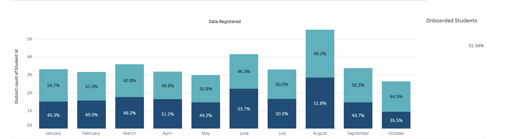
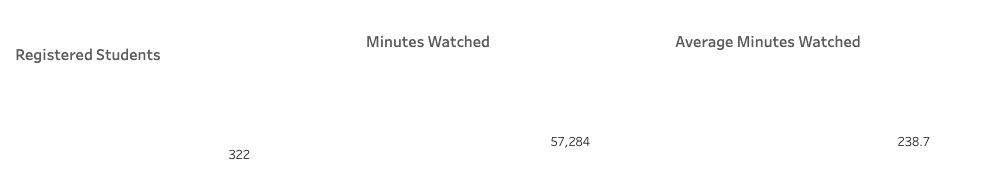

# Student-Customer-Engagement

## Analysing and Visualising Student Engagement, including key metrics, in a 3 page Dashboard

In this project, I am analysing the student engagament in an educational platform that offeres various tech courses. The project includes SQL queries to extract the data needed to create the visualisation and analysis, as well as key metrics that help identify critical areas of improvement within the educational platform.

### Objective
The questions to be answered in this project are as follows:

- Which courses are the most watched by students and how are they rated
- How many students register each month
- How is the student engagement: minutes watched and average minutes watched based on the different plans provided ( paid and free plan)
- Which countries have the most registered students and does this number scale proportionally to the number of minutes watched per country

1. Retrieving Student Information with SQL
   The [student_info_query](student_info_query.sql) can be found here
2. Retrieving Courses Information with SQL
   The [courses_info_query](course_info_query.sql) can be found here
3. Retrieving Purchasing Information with SQL
   The [purchase_info_query](purchase_info_query.sql) can be found here

### Analysing the Results

[Page 3](https://public.tableau.com/app/profile/veronica.mucha/viz/CustomerEngagement-Final/Page1) of the Dashboard shows the Top 5 most watched courses by students. This is rated by total minutes watched, Averagerage minutes, number of ratings and average rating. The Introduction to Data and Data Science course is the most popular/wached course amongst students. This would imply that the Data Science course is what most students are looking to embark on as a career. 

The most-watched course by total minutes is "Introduction to Data and Data Science" with 333,265.9 minutes, likely due to its role as a foundational course. Despite being nearly two hours long, its high rating reflects its importance. "SQL" leads in average minutes watched per student at 144.6 minutes, attributed to its necessity for data science careers and its longer duration of about 8 hours. The "Python Programmer Bootcamp" also has a long duration (11 hours). Other popular courses include "Statistics," "Introduction to Excel," and "Python Programmer Bootcamp," all with high ratings around 4.8.

The platform registered 35,230 students over the analysis period, with an onboarding rate exceeding 50%, indicating that over half of the registered students watched a lecture. However, this raises the question of why the other half did not engage. Possible reasons include user experience issues, lack of interesting content, or uncertainty about where to start. To address this, the platform can:

   - Test for user experience issues
   - Add more relevant content or better target potential users
   - Improve the user journey and provide clearer learning paths

     
The monthly onboarding rate fluctuates between 46% and 64%, with October showing a slightly higher rate, possibly due to incomplete data for the final 11 days of the month.

[Page 1](https://public.tableau.com/app/profile/veronica.mucha/viz/CustomerEngagement-Final/Page1) During the analysis period from January 1, 2022, to October 20, 2022, free-plan students watched about 491,000 minutes, whereas paying students watched around 1,345,000 minutes. This significant difference is attributed to free-plan students being less motivated and having limited access (about 30 minutes per course). 

In contrast, paying students seek more value and are more dedicated, watching an average of 670 minutes compared to 29 minutes for free-plan students. In August, when the platform was opened for free, the average minutes watched by free-plan students increased to about 70 minutes, indicating higher engagement during this period.

